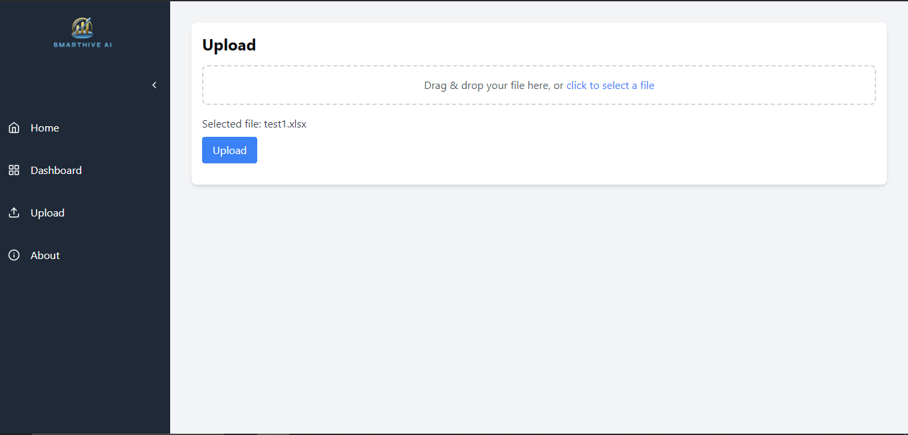
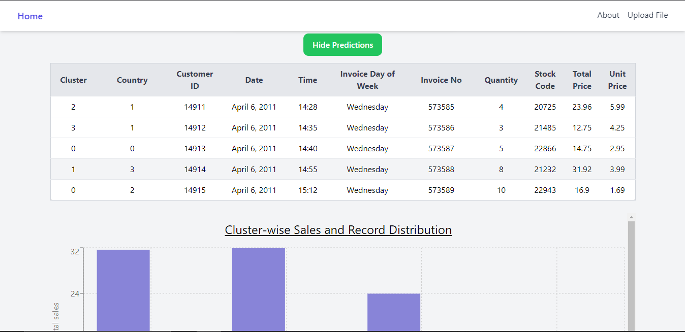
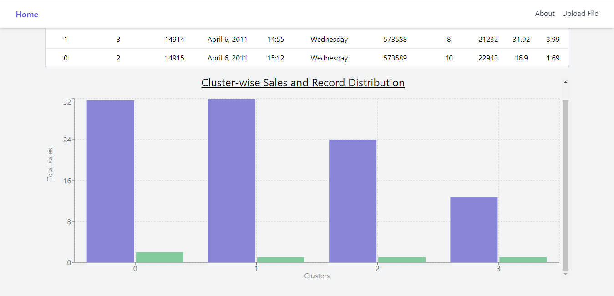

# smarthive-ai

## Installation

```bash
git clone https://github.com/SKitavi/Smarthive-ai
```

## Usage

Navigate to each directory i.e backend and frontend and follow the instructions on each directory's `README.md` file

```bash
cd backend
```

```bash
cd frontend
```

**NB: For the file upload use `retail.xlsx` or `test*.xlsx` for testing**

## Overview




